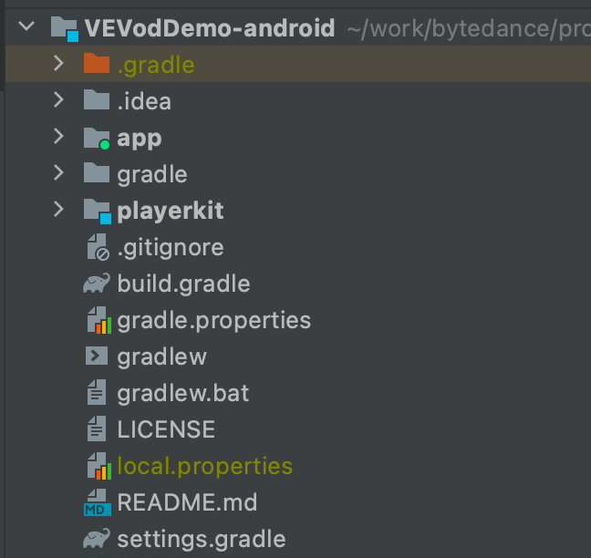

# VEVodDemo-android
VEVodDemo-android 是火山引擎视频云点播 SDK Android 端的开源 Demo. 为方便业务接入，我们开发了 `播放控件层 SDK(PlayerKit)` 来帮助业务快速接入点播 SDK。
Demo 中使用 `播放控件层 SDK` 实现了常见的三种播放场景：
- 小视频场景（Small Video）- 类似抖音首页竖版视频场景
- 短视频场景（Short Video）- 类似西瓜视频 Feed 视频流场景
- 长视频场景（Long Video） - 类似爱奇艺/腾讯视频/优酷视频的电视剧/电影场景

`播放控件层 SDK` 在内部封装了火山引擎点播 SDK，目标是让业务在实现视频播放业务时 focus 在 View 层的实现，降低播放器接入的难度。

# 目录结构
```text
|--VEVodDemo-android
|--|--app           // Demo App 模块
|--|--playerkit     // 火山引擎点播 SDK 播放控件层 SDK
```

# 编译运行
1. 命令行编译
```shell
cd VEVodDemo-android
git checkout feature/playerkit/dev
./gradlew :app:installdebug
```
2. Android Studio 打开 `VEVodDemo-android` 文件夹，点击运行 `app`.

# 播放控件层 SDK 使用

playerkit 是开源的，可以 copy 或 link 到项目中使用，根据需要进行源码修改。

## PlayerKit 集成
1. clone git 仓库
```shell
git clone https://github.com/volcengine/VEVodDemo-android
cd VEVodDemo-android
git checkout feature/playerkit/dev
```

2. 在 settings.gradle 中引入 playerkit 模块
```groovy
include ':app'

gradle.ext.playerKitModulePrefix = 'playerkit:'
// 这里示例 playerkit app 同级目录的 case。 您需要根据 VEVodDemo-android 的 clone 路径来调整这里的路径
// 或者将 playerkit 目录拷贝到项目中，采用下面的路径集成
apply from: new File(getRootDir(), 'playerkit/config/library_settings.gradle')
```

3. 在 App module 的 build.gradle 中引入 playerkit 依赖
```groovy
dependencies {
    implementation project(":${gradle.ext.playerKitModulePrefix}flavor:flavor-volc-ui")
}
```

4. sync 一下 gradle，完成集成.

   
## PlayerKit 模块说明
| 模块 | 描述 |  |
| ---- | ---- | ---- |
| :ui:player-ui | 默认风格的业务 ui 模块 | 我们基于播放控件层 Layer 系统，参考西瓜/抖音播放界面风格实现了一些默认的 UI 来帮助业务快速集成。若默认风格不满足需求，可以随意修改源码。|
| :core:player-volcengine | 火山引擎播放器适配模块  | 1. 用播件层的播放器接口，实现了火山引擎播放器.2. 封装了火山引擎播放器初始化模块，方便业务快速集成。火山引擎播放器 [官方文档](https://www.volcengine.com/docs/4/52) |
| :library:player-settings | 播放器 options 配置模块 | 方便业务在 App 中调整播放器配置                              |
| :library:player-playback | 播放流程控制模块 | 1. 封装了VideoView 和 VideoLayer，方便客户基于 VideoLayer 实现灵活/高复用的播放UI。2. 封装了 PlaybackController 把一次播放 Session 开始/结束时 Player/VideoView/MediaSource 的相互调用关系串起来。 |
| :library:player | 播放器适配模块 | 定义了控件层播放器的标准接口，方便适配各种播放器。 |
| :library:player-util | 工具类模块 | 各模块需要的常见工具类如 logcat 输出等 |


## PlayerKit 快速开始
下面用一个简单的例子快速展示 playerkit 的使用方式。完成后即可完成类似西瓜视频单个视频的播放界面，包含各种播放相关功能。 
在完成 playerkit 的集成后，以下代码可以直接 copy 到工程中使用。

<video width="720" height="1280" controls>
    <source src="movie.mp4" type="doc/res/video/quick_start_demo.mp4">
</video>

1. 初始化 SDK
> App.java
```java
public class App extends Application {
    
    @Override
    public void onCreate() {
        super.onCreate();

        L.ENABLE_LOG = true; // 控件层 logcat 开关

        VolcPlayerInit.AppInfo appInfo = new VolcPlayerInit.AppInfo.Builder()
                .setAppId("229234")
                .setAppName("VOLCVodDemo")
                .setAppRegion("VOLCVodDemoAndroid")
                .setAppChannel("china")
                .setAppVersion(BuildConfig.VERSION_NAME)
                .setLicenseUri("assets:///license2/volc_vod_demo_license2.lic")
                .build();
        VolcPlayerInit.init(this, appInfo);
    }
}
```
* 初始化需要的 APP_ID / LicenseUri 信息请登陆火山引擎点播控制台获取, 参考官方文档: [管理应用](https://www.volcengine.com/docs/4/65772)
* VolcPlayerInit 中实现了 [快速开始](https://www.volcengine.com/docs/4/65783) 中初始化部分，只需要传入相关初始化参数即可。

2. 使用 VideoView 进行播放
> activity_simple_video.xml
```xml
<FrameLayout xmlns:android="http://schemas.android.com/apk/res/android"
    android:layout_width="match_parent"
    android:layout_height="match_parent">

    <com.bytedance.playerkit.player.playback.VideoView
        android:id="@+id/videoView"
        android:layout_width="match_parent"
        android:layout_height="match_parent" />

</FrameLayout>
```

> SimpleVideoActivity.java
```java
public class SimpleVideoActivity extends AppCompatActivity {

    private VideoView videoView;

    @Override
    protected void onCreate(Bundle savedInstanceState) {
        super.onCreate(savedInstanceState);
        setContentView(R.layout.activity_simple_video);

        ActionBar actionBar = getSupportActionBar();
        if (actionBar != null) {
            actionBar.hide();
        }
        
        // 1. create VideoView instance
        videoView = findViewById(R.id.videoView);
        
        // 2. create VideoLayerHost instance. Add Layers to VideoLayerHost.
        VideoLayerHost layerHost = new VideoLayerHost(this);
        layerHost.addLayer(new GestureLayer());
        layerHost.addLayer(new FullScreenLayer());
        layerHost.addLayer(new CoverLayer());
        layerHost.addLayer(new LogLayer()); // log layer
        layerHost.addLayer(new TimeProgressBarLayer());
        layerHost.addLayer(new TitleBarLayer());
        layerHost.addLayer(new QualitySelectDialogLayer());
        layerHost.addLayer(new SpeedSelectDialogLayer());
        layerHost.addLayer(new MoreDialogLayer());
        layerHost.addLayer(new TipsLayer());
        layerHost.addLayer(new SyncStartTimeLayer());
        layerHost.addLayer(new VolumeBrightnessIconLayer());
        layerHost.addLayer(new VolumeBrightnessDialogLayer());
        layerHost.addLayer(new TimeProgressDialogLayer());
        layerHost.addLayer(new PlayErrorLayer());
        layerHost.addLayer(new PlayPauseLayer());
        layerHost.addLayer(new LockLayer());
        layerHost.addLayer(new LoadingLayer());
        layerHost.addLayer(new PlayCompleteLayer());

        // 3. attach VideoLayerHost to VideoView
        layerHost.attachToVideoView(videoView);
        
        // 4. config VideoView
        videoView.selectDisplayView(DisplayView.DISPLAY_VIEW_TYPE_SURFACE_VIEW);
        videoView.setDisplayMode(DisplayModeHelper.DISPLAY_MODE_ASPECT_FIT);
        
        // 5. create PlaybackController and bind VideoView
        PlaybackController controller = new PlaybackController();
        controller.bind(videoView);
        
        // 6. create MediaSource and bind into VideoView
        MediaSource mediaSource = createQualitySelectionMediaSource();
        //MediaSource mediaSource = createSimpleMediaSource();
        videoView.bindDataSource(mediaSource);
    }

    /**
     * 创建多分辨率播放源，配合 QualitySelectDialogLayer 可以默认实现清晰度切换功能
     */
    private MediaSource createQualitySelectionMediaSource() {
        MediaSource mediaSource = new MediaSource(UUID.randomUUID().toString(), MediaSource.SOURCE_TYPE_URL);
        Track track0 = new Track();
        track0.setTrackType(Track.TRACK_TYPE_VIDEO);
        track0.setUrl("https://file-examples-com.github.io/uploads/2017/04/file_example_MP4_480_1_5MG.mp4"); // 480x270
        track0.setQuality(new Quality(Quality.QUALITY_RES_240, "240P"));

        Track track1 = new Track();
        track1.setTrackType(Track.TRACK_TYPE_VIDEO);
        track1.setUrl("https://file-examples-com.github.io/uploads/2017/04/file_example_MP4_640_3MG.mp4"); // 640x360
        track1.setQuality(new Quality(Quality.QUALITY_RES_360, "360P"));

        Track track2 = new Track();
        track2.setTrackType(Track.TRACK_TYPE_VIDEO);
        track2.setUrl("https://file-examples-com.github.io/uploads/2017/04/file_example_MP4_1280_10MG.mp4"); // 1280x720
        track2.setQuality(new Quality(Quality.QUALITY_RES_720, "720P"));

        Track track3 = new Track();
        track3.setTrackType(Track.TRACK_TYPE_VIDEO);
        track3.setUrl("https://file-examples-com.github.io/uploads/2017/04/file_example_MP4_1920_18MG.mp4"); // 1920x1080
        track3.setQuality(new Quality(Quality.QUALITY_RES_1080, "1080P"));

        mediaSource.setTracks(Arrays.asList(track0, track1, track2, track3));
        return mediaSource;
    }

    /**
     * 快速创建单清晰度播放源
     */
    private MediaSource createSimpleMediaSource() {
        String url = "https://file-examples-com.github.io/uploads/2017/04/file_example_MP4_1280_10MG.mp4";
        // media Id 和 cacheKey 若不指定，内部会自动生成
        return MediaSource.createUrlSource(/*mediaId*/null, url, /*cacheKey*/null);
    }

    @Override
    protected void onResume() {
        super.onResume();
        // 7. start playback in onResume
        videoView.startPlayback();
    }

    @Override
    protected void onPause() {
        super.onPause();
        // 8. pause playback in onResume
        videoView.pausePlayback();
    }

    @Override
    protected void onDestroy() {
        super.onDestroy();
        // 9. stop playback in onResume
        videoView.stopPlayback();
    }

    @Override
    public void onBackPressed() {
        // 10. handle back pressed event
        if (videoView != null && videoView.layerHost().onBackPressed()) {
            return;
        }
        super.onBackPressed();
    }
}
```
播放控件层的更多用法请参考 app demo 中的实现。

# Issue
有任何问题可以提交 github issue，我们会定期 check 解决。

# PullRequests
暂不接受 PullRequests。

# License
```text
Copyright 2021 bytedance

Licensed under the Apache License, Version 2.0 (the "License");
you may not use this file except in compliance with the License.
You may obtain a copy of the License at

   http://www.apache.org/licenses/LICENSE-2.0

Unless required by applicable law or agreed to in writing, software
distributed under the License is distributed on an "AS IS" BASIS,
WITHOUT WARRANTIES OR CONDITIONS OF ANY KIND, either express or implied.
See the License for the specific language governing permissions and
limitations under the License.
```


